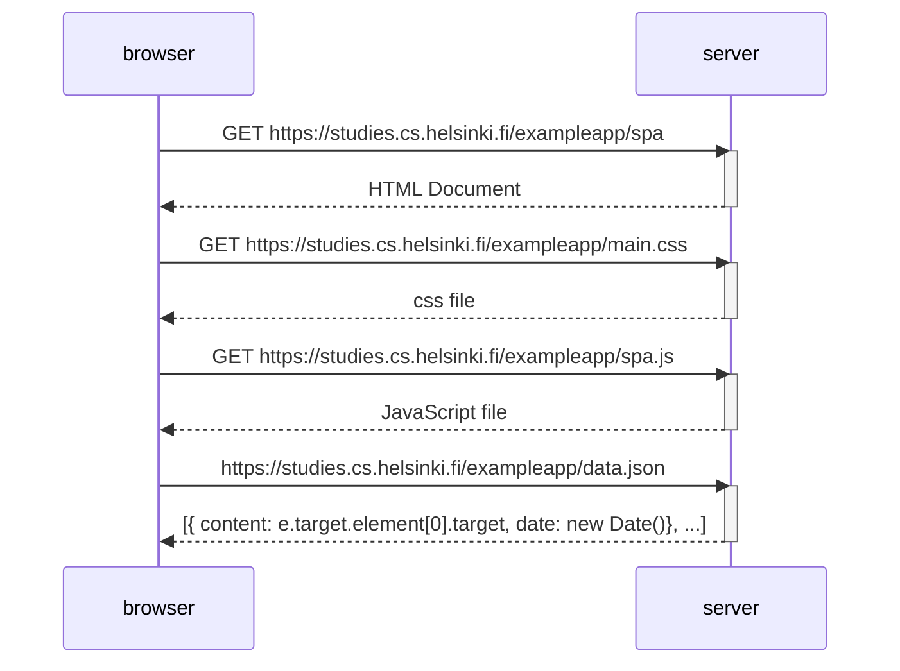

```mermaid
sequenceDiagram
    participant browser
    participant server

    browser->>server: GET https://studies.cs.helsinki.fi/exampleapp/spa
    activate server
    server-->>browser: HTML Document
    deactivate server

    %% HTML page is fetched from the server

    browser->>server: GET https://studies.cs.helsinki.fi/exampleapp/main.css
    activate server
    server-->>browser: css file
    deactivate server

    browser->>server: GET https://studies.cs.helsinki.fi/exampleapp/spa.js
    activate server
    server-->>browser: JavaScript file
    deactivate server

    %% the browser executes the JavaScript code that fetches the JSON data from the server

    browser->>server: https://studies.cs.helsinki.fi/exampleapp/data.json
    activate server
    server-->>browser: [{ content: e.target.element[0].target, date: new Date()}, ...]
    deactivate server

    %% the browser executes the callback function that renders the notes
    

```