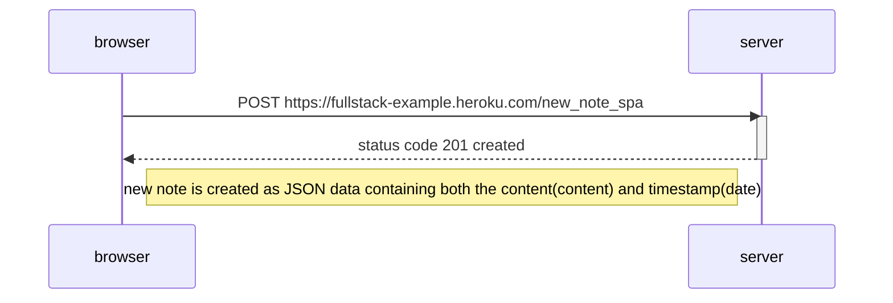

```mermaid
sequenceDiagram
    participant browser
    participant server

    browser->>server: POST https://fullstack-example.heroku.com/new_note_spa
    activate server
    server-->>browser: status code 201 created
    deactivate server

    %% the JavaScript code fetched from the server is used to send the form data

    Note right of browser: new note is created as JSON data containing both the content(content) and timestamp(date)

```
